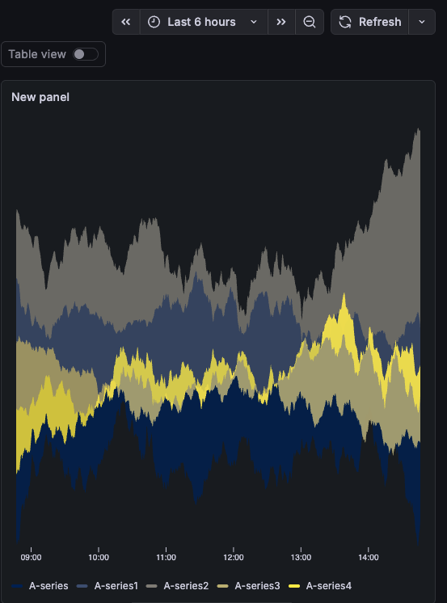
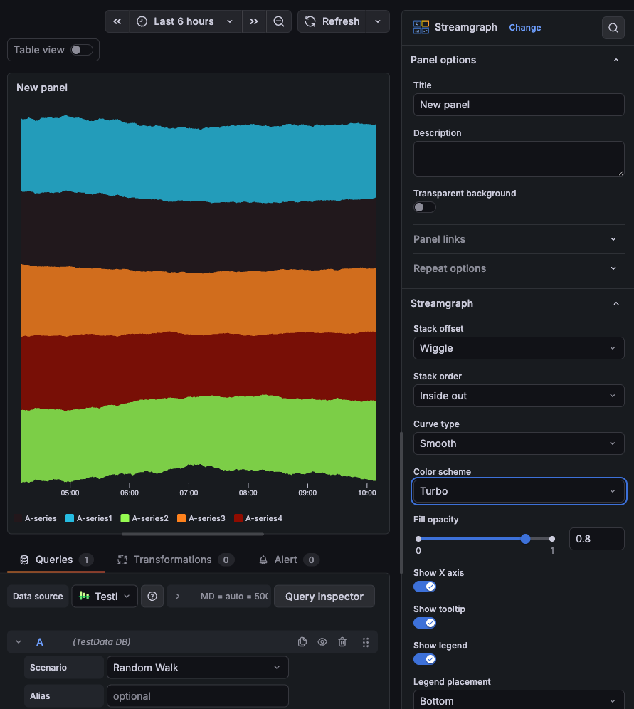
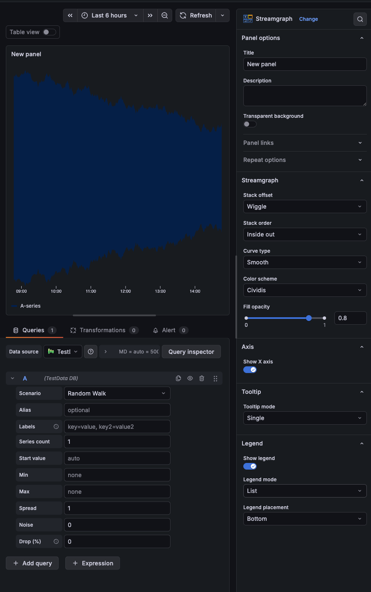

# Grafana Streamgraph Panel

A [streamgraph](https://en.wikipedia.org/wiki/Streamgraph) panel for Grafana.
Stacked areas flow around a central baseline, so you can see relative volume
across many series at a glance.

## What you get

- Four stack offsets (Wiggle, Silhouette, Zero, Expand) and four orderings
- Smooth, Linear, or Step curves
- 21 color schemes: 10 D3 gradients (Cividis, Turbo, Viridis, Spectral, Plasma,
  Inferno, Magma, Cool, Warm, Rainbow) and 11 Grafana palette registry schemes
  (Classic, Blues, Reds, Greens, Purples, and 6 diverging gradients)
- Adjustable fill opacity
- Band labels: series names rendered inside bands at their widest point, with
  configurable color, font sizing, contrast stroke, and opacity fade
- Legend in List or Table mode (Table shows min/max/mean/last/etc.)
- Tooltip: hover one series or see all at once, with sort and hide-zeros
- Works with wide-format and multi-frame time series

## Requirements

Grafana 12.3.0+

## Options

Everything lives in the panel editor sidebar:

| Section     | Option            | Values / range                                                                                                                                                                                                   | Default |
| ----------- | ----------------- | ---------------------------------------------------------------------------------------------------------------------------------------------------------------------------------------------------------------- | ------- |
| Streamgraph | Stack offset      | Wiggle, Silhouette, Zero, Expand                                                                                                                                                                                 |         |
| Streamgraph | Stack order       | Inside out, Ascending, Descending, None                                                                                                                                                                          |         |
| Streamgraph | Curve type        | Smooth, Linear, Step                                                                                                                                                                                             |         |
| Streamgraph | Color scheme      | Cividis, Turbo, Viridis, Spectral, Plasma, Inferno, Magma, Cool, Warm, Rainbow, Classic, Green-Yellow-Red, Red-Yellow-Green, Blue-Yellow-Red, Yellow-Red, Blue-Purple, Yellow-Blue, Blues, Reds, Greens, Purples |         |
| Streamgraph | Fill opacity      | 0 -- 1 (slider)                                                                                                                                                                                                  | 0.8     |
| Band Labels | Show labels       | on/off                                                                                                                                                                                                           | off     |
| Band Labels | Label color †     | Inverse, Auto (contrast), White, Black                                                                                                                                                                           | Inverse |
| Band Labels | Min font size †   | px (integer, ≥ 1)                                                                                                                                                                                                | 8       |
| Band Labels | Max font size †   | px (integer, ≥ 1)                                                                                                                                                                                                | 48      |
| Band Labels | Min band height † | px (integer, ≥ 1) — bands narrower than this are unlabeled                                                                                                                                                       | 8       |
| Band Labels | Font scale †      | 0.1 -- 1.5 (slider, step 0.05)                                                                                                                                                                                   | 0.7     |
| Band Labels | Stroke width †    | 0 -- 3 px (slider, step 0.5) — outline behind label text                                                                                                                                                         | 0       |
| Band Labels | Opacity fade †    | on/off — ramp opacity over narrow bands vs snap                                                                                                                                                                  | on      |
| Axis        | Show X axis       | on/off                                                                                                                                                                                                           |         |
| Tooltip     | Tooltip mode      | Single, All series, Hidden                                                                                                                                                                                       |         |
| Tooltip     | Sort order        | None, Ascending, Descending                                                                                                                                                                                      |         |
| Tooltip     | Hide zeros        | on/off                                                                                                                                                                                                           |         |
| Tooltip     | Max width         | px (integer) — caps tooltip width; blank = automatic                                                                                                                                                             |         |
| Tooltip     | Max height        | px (integer) — caps tooltip height in All series mode; blank = automatic                                                                                                                                         |         |
| Legend      | Show legend       | on/off                                                                                                                                                                                                           |         |
| Legend      | Legend mode       | List, Table                                                                                                                                                                                                      |         |
| Legend      | Legend placement  | Bottom, Right                                                                                                                                                                                                    |         |
| Legend      | Legend values     | Min, Max, Mean, Sum, Count, First, Last, etc.                                                                                                                                                                    |         |

† Only visible when **Show labels** is enabled.

## License

Apache 2.0
